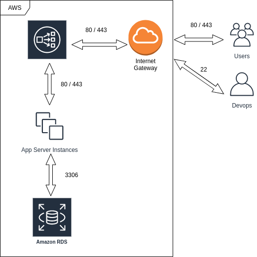

# Escalabilidade e alta disponibilidade

**ELB** (Elastic Load Balance)

  - Distribuir o tráfego entre diferentes destinos

  - Balancear tráfego TCP (por exemplo, portas diferentes da 80 e 443)
  
Referência oficial sobre [Elastic Load Balancing](https://aws.amazon.com/pt/elasticloadbalancing)  

Custo: [Definição de preço do Elastic Load Balancing](https://aws.amazon.com/pt/elasticloadbalancing/pricing)
 
## Load Balancing

**1) Parar a instância** criada anteriormente ("webCadastro")

**2) Criar o Load Balancer**

Em Load Balancing \ Load Balancers \ Create Load Balancer \ Application Load Balancer HTTP HTTPS (clicar em "Create") 

  - Nome: lb-webCadastro
  
  - Scheme: internet-facing (virado para a internet)
  
  - IP address type: Ipv4
  
  - Load Balancer Protocol ("Add listeners")
  
    - HTTP  80
	
	- HTTPS 443
	
  - VPC (rede dentro da AWS)
  
  - Availability Zones (tudo será feito dentro dessas zonas de disponibilidade)
    
	- Selecionar duas subnets daquela VPC 
	
	- Next

  - No "Step 3: Configure Security Groups"
  
    - Criar um security group específico para o load balancer (marcar opção "Create a new security group")
	  
	  - lb-acesso-web
	  
	  - definir types HTTP e HTTPS
	  
	  - Next

  - No "Step 4: Configure Routing"
  
    - target group (onde o load balancing olha - são as intâncias que precisam estar agrupadas)
	  
	  - Name: tg-cadastroWeb
	 
  - Heath check: check se o root traz alguma resposta
    
	- Advanced health check settings
	
	  - Health threshold: 5 (número de tentativas de check que considera para alterar o status de uma máquina para OK)
	  
	  - Unhealth threshold: 5 (número de tentativas de check que considera para alterar o status de uma máquina para NOK)
	  
	  - Timeout: 5 segundos (limite para aguardar resposta do check, se não responder, vai considerar como falha)
	  
	  - Interval: 30 segundos (intervalo que faz o check da instância)
	  
	  - Success code: 200 (se retonar 200, considera OK)
	  
	  - Next
	  
  - No "Step 5: Register Targets" (associar o **grupo do auto scaling** e esse grupo que irá gerenciar as instâncias)

    - Irá apontar o serviço que irá escalar as máquinas, não para uma instância específica
	
	- Manter em branco por enquanto
	
	- Next
  
  - Step 6: Review
  
    - Create
	
**3) Configurar o Auto Scaling Group**

Assim que o load balancer estiver criado (aparece em Load Balancing \ Load Balancers), segue...

  - Em Auto Scaling \ Launch Configuration (**primeiro criar setup do auto scaling, para depois lança-lo**)
  
    - Clicar em "Create launch configuration"\ My AMIs \ Selecionar imagem criada anteriormente ("webCadastro")
    
	- Em "Create Launch Configuration", nomear o setup
	  - Name: as-config-webCadastro
	  - Next
	  
	- Next  
	
	- Tela "Create Launch Configuration"
	  - Selecionar os security group já existente de acesso-remoto (ssh), acesso-web (Apache) e "default" para comunicar com RDS na mesma rede
	  
	- Next  \ Criar launch configuration
	
	- Selecionar chave \ Next \ Next
		  
  - Em Auto Scaling \ Auto Scaling Groups \ clicar em "Create Auto Scaling Group" (**agora sim, criar o grupo do auto scaling**)
  
    - Selecionar "Launch Configuration"
	
	- Marcar o as-config-webCadastro (é o setup do auto scaling criado no passo anterior) \ Next
	
	- Tela "Create Auto Scaling Group"
	  - Group Name: as-group-cadastroWeb
	  - Newtwork: deixar a VPC default (é a que está sendo utilizada)
	  - Group size: 2 (começa com duas máquinas, por exemplo)
	  - Subnet: as mesmas subnets selecionadas quando criou o load balancer no campo "Availability Zones" 
	    - Tem que ser as subredes que fazem parte do grupo
		
	- Advanced Details
	  - Marcar "Receive traffic from one or more load balancers" (caso não marque, só deixa marcar as instâncias)
	  - Em "Target Groups", selecionar tg-cadastroWeb (criado no passo "Step 4: Configure Routing" - quando definiu o grupo do load balancer)
	  - Health Check Type: Marcar "ELB" (Elastic Load Balance).
	    - A opção "EC2" testa a integridade da instância, se está running, stopping, se está ligando/desligando
	    - Health Check Grace Period: para fins de teste, pode alterar para 30 segundos 	
		- Next
	
	- Create Auto Scaling Group
	  - Marcar "Keep this group at its initial size" (manter o size inicial configurado no grupo) \ Next
	  
	- Next \ Next \ Next
	
**Sobre criação do grupo de auto scaling é necessário:** 

   - Antes da criação do grupo de auto scaling, criar um template de configuração (launch config)
   - Configurar pelo menos duas sub-redes que devem coincidir com o **ELB**
   
**4) Testar o ambiente de produção**

  - Na listagem de grupos de auto scalling ("Auto Scaling \ Auto Scaling Groups"), selecionar o grupo criado ("as-group-cadastroWeb")
    - Na aba "Instances" serão listadas "x" instâncias (o número de instância configuradas na imagem) e para cada, como está seu status (Health Status)
	- Na aba "Monitoring" é possível acompanhar o monitoramento das máquinas
	
 - O ip de chegada não é mais o da instância, mas sim o do load balancer
   - Load Balancing \ Load Balancer
   - Selecionar o load balancer na listagem, obter o "DNS name" na aba "Description" (abrir este no navegador para testar)
     - O load balancer neste momento está mandando cada requisição para uma das instâncias criadas
	 - Inserir algum registro para verificar se está salvando no RDS
	 
	- Ir no Dashboard do EC2 (Instâncias em execução), terminar uma das instâncias, e na sequência recarregar a página no navegador
	  - Verificar se outra instância foi criada(quem gerencia isso é o grupo do auto scaling)
	  
**Checks possíveis de serem configurados no grupo de auto scaling:**

 - EC2 (estado da instância EC2): stopping, terminated, etc...
 - ELB (teste da aplicação: porta 80 (HTTP) está respondendo?

**5) Configurando domínio e políticas de auto scaling**

**Domínio:**

  - Associar um nome ao "DNS name" do load balancer
  
  - Criar conta no [Freenom](https://www.freenom.com/pt/index.html)
    - Criar domínio
	- Criar o **CNAME** (um "apelido") para o "Public DNS (IPv4)": ec2-9-99-999-99.compute-1.amazonaws.com
    - Freenom: sem custo, um pouco lenta a interface do gerenciamento
	
	- Outra opção de para conseguir CNAME free: [Dynu](https://www.dynu.com/en-US)
	  - Assim ec2-9-99-999-99.compute-1.amazonaws.com FICA http://cadastro.usuario.webredirect.org
	  
	- Testar no navegador ou linha de comando
	
		$ dig http://cadastro.usuario.webredirect.org
	  
**Políticas de auto scaling:**

Auto Scaling \ Auto Scaling Groups \ Selecionar o grupo de auto scaling ("as-group-cadastroWeb") \ Scaling Policies \ Add policy

Criar política para que quando a utilização de CPU chegar a 60%, suba uma nova instância

  - Name: CPU
  - Metric type: Average CPU Utilization
  - Target Value: 60
  - Instances need: 60 segundos to warm up after scaling (valor para teste)
  
Também baixa a instância se tiver abaixo de 60% de CPU

Não esquecer de ajustar em Actions \ Edit \ Max (**aumentar o máximo de instâncias**) 

Exemplo de cenário: Min: 2, Max: 6 
  - Se houver uma carga maior (ex. Black Friday), ocorrerá política de "CPU" e serão alocadas dinamicamente mais máquinas (até 6 instâncias)